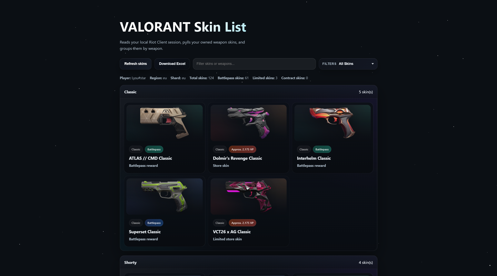
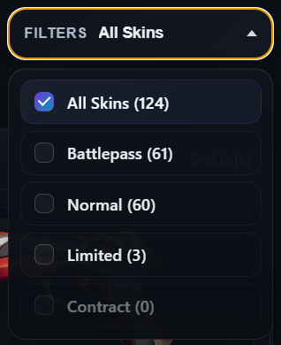
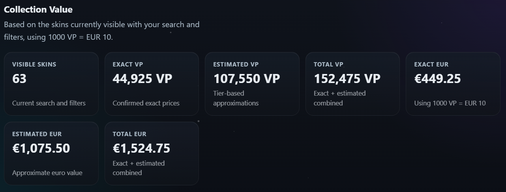
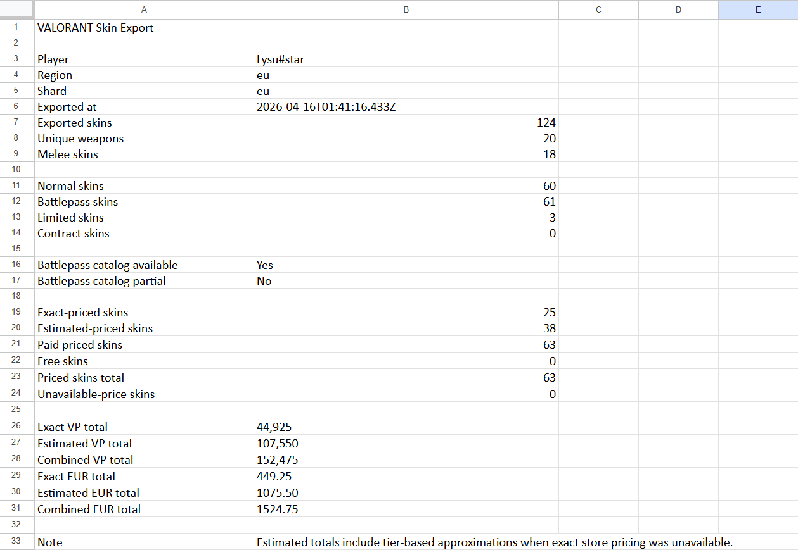

# VALORANT Inventory Grabber

A polished little local app for browsing your owned VALORANT skins, checking estimated VP value, filtering collections, and exporting everything to Excel.

It reads your local Riot session, fetches your inventory, and presents it in a cleaner desktop-friendly UI with rarity-aware styling, battlepass and limited filters, and a one-click export flow.

## What It Does

- Reads your local Riot Client / VALORANT session
- Shows your owned skins grouped by weapon
- Filters limited skins and battlepass skins
- Estimates VP totals when exact pricing is unavailable
- Exports your inventory to an Excel workbook
- Can be packaged as a Windows `.exe` for easy sharing

## Preview

This project is designed to feel a little more fun than a plain utility app, while still staying practical and easy to use.

### Main App



### Filter Dropdown



### Collection Value Summary



### Excel Export



## Stack

- Node.js
- Vanilla HTML, CSS, and JavaScript
- Electron for the Windows desktop build
- `xlsx` for Excel export generation

## Project Structure

```text
.
|-- electron/        Desktop wrapper for the packaged app
|-- public/          Frontend files
|-- src/
|   |-- config/      Shared constants
|   |-- services/    Riot session, catalog, pricing, and export logic
|   `-- utils/       Small HTTP/value helpers
|-- main.js          Browser/server entry point
`-- package.json
```

## Local Development

### Requirements

- Windows
- Node.js 18+
- Riot Client or VALORANT running and logged in

### Run in the Browser

```powershell
npm install
npm start
```

Then open [http://localhost:3010](http://localhost:3010).

### Run as a Desktop App

```powershell
npm run desktop
```

## Build the Windows Executable

```powershell
npm run build:win
```

The generated executable will be placed in:

```text
dist/VALORANT Inventory Grabber-<version>.exe
```

## Notes

- The app does not work without Riot Client or VALORANT running, because it reads the local Riot lockfile and session tokens on the machine using it.
- The packaged `.exe` is portable, but Windows may still show a SmartScreen warning if it is not code-signed.
- Some prices are exact, while others are tier-based estimates when public pricing data is incomplete.

## Publishing Checklist

Before making the repository public, it is worth double-checking:

- `package.json` version is the one you want to ship
- the app name and description match how you want to present it
- no private files or generated folders are committed
- you are happy with the license choice for the repo

## Disclaimer

This project is an unofficial fan-made utility and is not affiliated with or endorsed by Riot Games.
